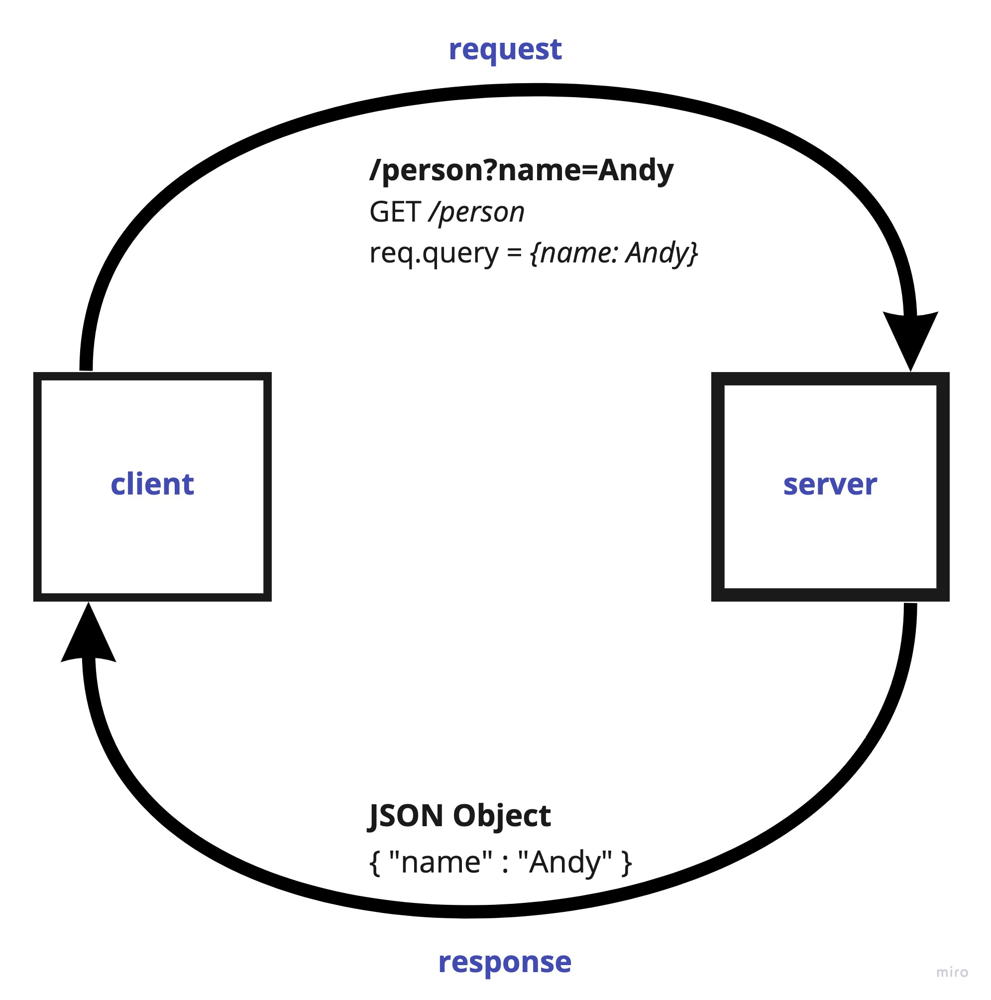

# LAB - Class 02

## Project: Basic Express Server

### Author: Brendan Smith

### Links and Resources

- [ci/cd](https://github.com/brendigler/basic-express-server/actions)
- [server url](https://brsmith-basic-express-server.herokuapp.com/)

### Setup

#### `.env` requirements

- `PORT` - Port Number

#### How to initialize/run your application

- clone to local repo
- `npm install`
- `npm start`

#### Tests

- Run tests with `npm test`
- Logger test was copied directly from class notes

#### UML / Application Wiring Diagram

